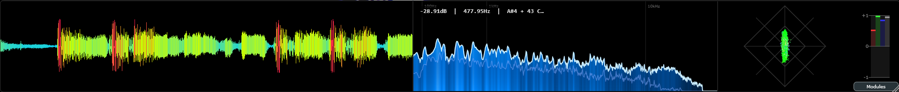
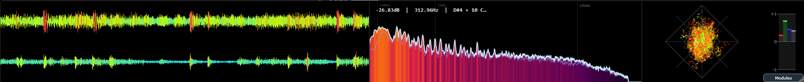

# CrystalPeaks

CrystalPeaks is a high-performance, modular audio metering system built with JUCE. It provides real-time visual analysis of audio signals with a focus on aesthetics and modularity.

[](https://drive.google.com/file/d/132KTLBJNvnsYbqz4O4RLeSL9_MlU0pmj/view?usp=drive_link)

## Interface




## Features

### Modular Layout System
- **Dynamic Docking**: Add or remove modules (Waveform, Spectrum, Stereometer) on the fly.
- **Resizable Dividers**: Seamlessly resize modules using subtle, draggable dividers with minimum width enforcement.
- **Compact Mode**: Hide the peak meter bar to maximize visualization area.

### Visualizer Modules

#### 1. Waveform Meter
- **Multi-Channel**: Monitor Left, Right, Mid, or Side channels.
- **Peak History**: Real-time multiband level history overlaid on the waveform.
- **Dynamic Coloring**: Supports Static, Multi-Band, and Color Map modes.

#### 2. Spectrum Analyzer
- **Modes**: Choose between traditional FFT line, Color Bars (Heatmap), or both.
- **Advanced Scaling**: Supports Linear, Logarithmic, and Mel (Musical) frequency scales.
- **Note Overlay**: Real-time pitch detection of the loudest frequency.
- **Color Palettes**: Features "Inferno" and the beautiful "Ice" gradient mode.

#### 3. Stereometer
- **Display Modes**: 
  - **Linear**: 1-to-1 rotated stereo mapping.
  - **Scaled**: Enhanced visibility for quiet samples.
  - **Lissajous**: Classic X/Y phase scope.
- **Correlation Meter**: Horizontal tick-style correlation indicator with history trails (Single or Multi-Band).
- **Color Modes**: Static, RGB (Frequency-based), and Multi-Band (Low/Mid/High overlays).

### Stick Mode (Windows)
- **AppBar Integration**: Reserves screen space at the top of the monitor, preventing other windows from overlapping.
- **Zero-Header Design**: Hides the title bar completely for a seamless, hardware-like look on your desktop.
- **Always on Top**: Keeps your meters visible at all times.

## Building and Running

### Prerequisites
- **CMake** (3.20 or later)
- **C++ Compiler** (MSVC 2022+ recommended for Windows)
- **JUCE** (Included/referenced in project structure)

### Build Instructions
```bash
# From the project root
cmake -B build
cmake --build build --config Debug
```

The executable will be generated at:
`build/MiniMeters_artefacts/Debug/CrystalPeaks.exe`

## Technical Details
- **Audio Engine**: Lock-free ring buffer architecture for high-performance audio processing.
- **UI Architecture**: Flex-ratio based `ModuleStrip` container for responsive layout management.
- **Crossover Processing**: Uses Linkwitz-Riley filters for accurate multiband analysis.


---

Designed and developed by **Parash**